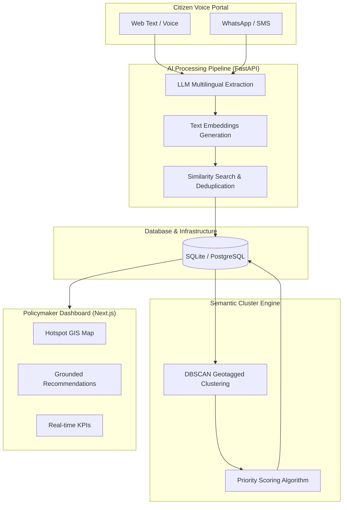

# CivicPulse AI (v2)

> **From Citizen Voice to Evidence-Based Public Investment**

CivicPulse AI is a scalable, multilingual AI public infrastructure decision-support platform designed as a **Digital Public Good (DPG)** for BRICS nations.

---

## 🌟 Core Features

- 🎤 **Multi-Channel Citizen Ingestion**: Web Voice, Web Text, and simulated Messaging Webhook (WhatsApp / SMS / Telegram).
- 🗣️ **Multilingual Understanding**: Native support for English, Hindi, Marathi, and extensible BRICS language packs (e.g., Portuguese).
- 🔍 **Duplicate Collapse vs. Semantic Clustering**: Separates repeat submissions (incrementing `duplicate_count`) from distinct related issues grouped into geographic clusters.
- ⚖️ **Digital-Divide Corrected Priority Engine**: Transparent 7-factor mathematical formula that applies positive corrections (+N priority points) to under-reported high-gap regions with low digital access.
- 📊 **Hotspot Intelligence & GIS Map**: Interactive Leaflet / PostGIS spatial visualization of regional demand, infrastructure gaps, and investment coverage.
- 💡 **Explainable Recommendations & Human-in-the-Loop**: Comprehensive evidence panel explaining exact score calculations; policymaker approval workflow.
- 📈 **Retrospective Investment Impact Tracking**: Tracks pre- vs. post-project infrastructure indices and complaint drops for completed investments, proving real-world ROI.
- 🔔 **Citizen Status Feedback Loop**: Allows citizens to look up `#REQ-xxxxx` status without requiring sign-in.
- 🌐 **Digital Public Good Standard**: Apache 2.0 licensed, SDG aligned, with open data export (`/api/v1/open-data/export`).

---

## 🏛️ System Architecture & Workflow

CivicPulse AI operates on a modern, decoupled architecture connecting citizen-facing ingestion to AI-powered policymaker analytics.



### 🔄 Request Workflow
1. **Submission**: A citizen submits a localized issue (via voice or text in any supported language).
2. **Extraction & NLP**: The LLM extracts the core issue, severity, and intent, mapping it to standard ontologies.
3. **Deduplication**: Using text embeddings, the system identifies if this issue has already been reported, increasing the `duplicate_count` to measure severity instead of creating noise.
4. **Clustering & Priority**: Background processes cluster related geographical requests. The priority engine scores these clusters based on infrastructure gaps, demographics, and a unique Digital Divide Correction formula.
5. **Action**: Policymakers view clustered hotspots, approve auto-generated evidence-grounded recommendations, and track the impact of the investment.

---

## 🏗️ Repository Architecture

```text
civicpulse-ai/
├── backend/                  # FastAPI Application
│   ├── app/
│   │   ├── api/v1/          # REST Endpoints & Webhooks
│   │   ├── ai/              # Provider Abstraction & Extraction Pipeline
│   │   ├── core/            # Config, DB, Security
│   │   ├── models/          # SQLAlchemy Database Models
│   │   ├── schemas/         # Pydantic Schemas & Validation
│   │   └── services/        # Priority Engine & Impact Tracker
│   └── tests/               # Pytest Suite
├── frontend/                 # Next.js 14 Web Application
│   ├── src/app/             # App Router Pages (Citizen Portal & Dashboard)
│   ├── src/components/      # UI, Maps, Charts, Evidence Panel
│   └── src/lib/             # API Client & Helpers
├── data/                    # Synthetic & Seeder Datasets
├── docs/                    # Architecture, API & DPG Compliance Docs
├── scripts/                 # Seeder & Demo Scripts
├── docker-compose.yml       # PostgreSQL + PostGIS + pgvector + Redis
├── LICENSE                  # Apache 2.0 License
└── README.md
```

---

## 🚀 Getting Started

### Prerequisites
- Python 3.11+
- Node.js 18+
- PostgreSQL 16+ with `postgis` & `pgvector` extensions (or Docker)

### Quick Start (Local Development)

1. **Clone & Setup Environment**
   ```bash
   cp .env.example .env
   ```

2. **Start Backend (FastAPI)**
   ```bash
   cd backend
   pip install -r requirements.txt
   uvicorn app.main:app --reload --port 8000
   ```

3. **Seed Demo Data**
   ```bash
   python scripts/seed_demo_data.py
   ```

4. **Start Frontend (Next.js)**
   ```bash
   cd frontend
   npm install
   npm run dev
   ```
   Open `http://localhost:3000` for Citizen Portal & Policymaker Dashboard.

---

## 🚧 Known Limitations & Roadmap

As an agile hackathon prototype demonstrating core value and AI safety:
- **Database Backend**: SQLite is currently utilized for local development to ensure an out-of-the-box working demo. The schema is built on SQLAlchemy and is designed for a seamless migration to **PostgreSQL + PostGIS + pgvector** in production.
- **Rate Limiting**: Rate limiting for anomaly detection is configured and actively enforced in-memory to prevent spam bursts; a production deployment will offload this to Redis.
- **Recommendation Generation**: For perfect grounding guarantees in this demo, recommendation texts are template-based. LLM connections are built into the pipeline interface, awaiting enablement.
- **Authentication**: Basic policymaker operations assume a trusted local environment or rely on basic API key verification. Production deployments will require robust OAuth2 / OIDC integration.

---

## 📜 License & DPG Compliance

Licensed under the [Apache License 2.0](LICENSE). Complies with the 9 indicators of the Digital Public Goods Alliance standard (see [docs/dpg-compliance.md](docs/dpg-compliance.md)).
