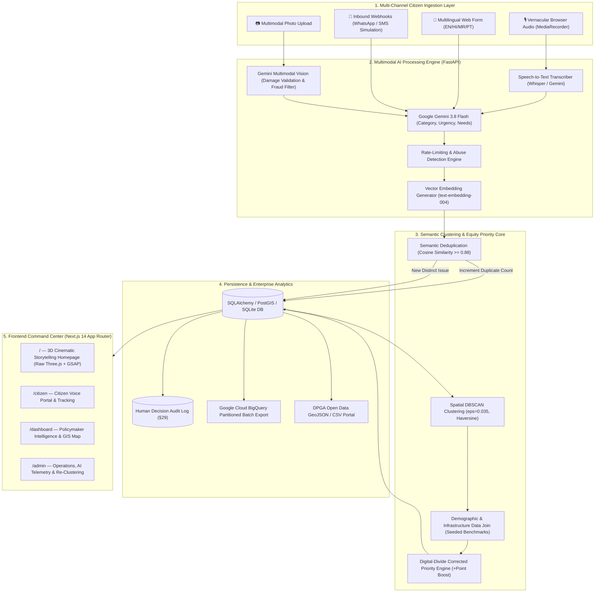

# CivicPulse AI (v2.0)
### Digital Public Infrastructure & AI-Powered Governance Platform for BRICS+ Nations

[](https://opensource.org/licenses/Apache-2.0)
[](https://nextjs.org/)
[](https://fastapi.tiangolo.com/)
[](https://ai.google.dev/)
[](https://threejs.org/)
[](https://digitalpublicgoods.net/)
[](backend/tests/)

> **Track 1: AI for Digital Public Infrastructure & Governance**  
> *Transforming fragmented citizen voice signals into mathematically equitable, evidence-backed public infrastructure investments.*

---

## 🧭 Executive Summary

Traditional public grievance and civic infrastructure allocation systems suffer from four fundamental systemic failures:

1. **The Literacy & Language Chasm**: Millions of rural citizens speak vernacular languages (e.g., Marathi, Hindi, regional dialects) and cannot navigate complex bureaucratic drop-downs or text forms.
2. **The Urban Reporting Bias**: Wealthy urban corridors with 90%+ smartphone tele-density file 10× more digital complaints than remote tribal hamlets. Uncorrected algorithms mistake high smartphone reporting for highest humanitarian urgency, starving marginalized villages of water and road funds.
3. **Fragmented Noise vs. Geographic Signal**: Disparate citizen complaints arrive as thousands of isolated tickets rather than unified spatial clusters representing systemic infrastructure breakdowns (e.g., a burst main pipe vs. 50 individual tap complaints).
4. **Black-Box Allocations & Zero Follow-Through**: Municipal decisions lack explainability, leaving citizens alienated and failing to measure whether disbursed capital actually resolved the underlying grievance.

**CivicPulse AI** solves this by establishing an end-to-end, multilingual Digital Public Infrastructure (DPI) platform. Built upon Google Gemini 3.8 Flash, raw Three.js WebGL visualization, spatial DBSCAN clustering, and an explainable **Digital Divide Corrected Priority Engine**, CivicPulse equips District Magistrates and policymakers to disburse capital with mathematical equity, complete transparency, and closed-loop impact verification.

---

## 🏛️ Comprehensive Architecture & Data Flow

CivicPulse AI operates on a modern, decoupled client-server architecture designed for high availability, zero memory leaks, and transparent human-in-the-loop governance.

### High-Level System Architecture Diagram


```mermaid
flowchart TD
    %% Citizen Ingestion Channels
    subgraph Ingestion["1. Multi-Channel Citizen Ingestion Layer"]
        Voice["🎙️ Vernacular Browser Audio (MediaRecorder)"]
        Text["📝 Multilingual Web Form (EN/HI/MR/PT)"]
        Msg["💬 Inbound Webhooks (WhatsApp / SMS Simulation)"]
        Vision["📷 Multimodal Photo Upload"]
    end

    %% AI Ingestion & Analysis Engine
    subgraph AIEngine["2. Multimodal AI Processing Engine (FastAPI)"]
        STT["Speech-to-Text Transcriber (Whisper / Gemini)"]
        GeminiLLM["Google Gemini 3.8 Flash (Category, Urgency, Needs)"]
        GeminiVision["Gemini Multimodal Vision (Damage Validation & Fraud Filter)"]
        Embedder["Vector Embedding Generator (text-embedding-004)"]
        RateLimit["Rate-Limiting & Abuse Detection Engine"]
    end

    %% Clustering & Scoring
    subgraph AnalyticsEngine["3. Semantic Clustering & Equity Priority Core"]
        Dedup["Semantic Deduplication (Cosine Similarity >= 0.88)"]
        DBSCAN["Spatial DBSCAN Clustering (eps=0.035, Haversine)"]
        CensusJoin["Demographic & Infrastructure Data Join (Seeded Benchmarks)"]
        PriorityFormula["Digital-Divide Corrected Priority Engine (+Point Boost)"]
    end

    %% Storage & Analytics
    subgraph StorageLayer["4. Persistence & Enterprise Analytics"]
        DB[("SQLAlchemy / PostGIS / SQLite DB")]
        AuditLog[("Human Decision Audit Log (§29)")]
        BigQuery["Google Cloud BigQuery Partitioned Batch Export"]
        OpenData["DPGA Open Data GeoJSON / CSV Portal"]
    end

    %% Frontend Command Center
    subgraph Frontend["5. Frontend Command Center (Next.js 14 App Router)"]
        Story["/ — 3D Cinematic Storytelling Homepage (Raw Three.js + GSAP)"]
        CitizenPortal["/citizen — Citizen Voice Portal & Tracking"]
        Dashboard["/dashboard — Policymaker Intelligence & GIS Map"]
        AdminConsole["/admin — Operations, AI Telemetry & Re-Clustering"]
    end

    %% Connections
    Voice --> STT --> GeminiLLM
    Text --> GeminiLLM
    Msg --> GeminiLLM
    Vision --> GeminiVision --> GeminiLLM
    GeminiLLM --> RateLimit --> Embedder
    Embedder --> Dedup
    Dedup -->|Increment Duplicate Count| DB
    Dedup -->|New Distinct Issue| DB
    DB --> DBSCAN --> CensusJoin --> PriorityFormula --> DB
    DB --> AuditLog
    DB --> BigQuery
    DB --> OpenData
    DB --> Frontend
```

---

## 🧮 The Core Mathematical Equity Formula

To eliminate urban reporting bias, CivicPulse computes an explainable multi-criteria priority score for every detected infrastructure hotspot cluster:

$$\text{Priority Score} = \min\left(100, \, w_1 \cdot C_{\text{norm}} + w_2 \cdot G_{\text{infra}} + w_3 \cdot V_{\text{vuln}} + w_4 \cdot U_{\text{urgency}} + w_5 \cdot P_{\text{pop}} + \mathbf{\Delta_{\text{digital}}}\right)$$

### 1. The Digital Divide Correction Factor ($\mathbf{\Delta_{\text{digital}}}$)
Traditional systems reward high smartphone reporting. CivicPulse inverts this bias:

$$\mathbf{\Delta_{\text{digital}}} = \begin{cases} 
\min\left(15.0, \, \mathbf{k_{\text{boost}}} \times \frac{\bar{T} - T_{\text{region}}}{\bar{T}} \times G_{\text{infra}}\right), & \text{if } T_{\text{region}} < \bar{T} \\
0, & \text{otherwise}
\end{cases}$$

- $T_{\text{region}}$: Tele-density and smartphone internet penetration index of the district (0–100).
- $\bar{T}$: National/state average digital penetration benchmark (~65.0).
- $G_{\text{infra}}$: Measured infrastructure deficit gap ($100 - \text{Coverage Score}$).
- **Result in Practice**: In Bhamragad Block (Gadchiroli District, tele-density = 38.0), an automatic **+6.0 point equity correction** is applied. A critical drinking water failure is promoted to `#1 Priority (Score: 91.3)`, preventing urban cosmetic road repaving in Pune (Score: 78.5) from capturing the budget.

---

## 🖥️ Four Routes, One Cohesive Application

CivicPulse AI is structured as a single Next.js 14 project under the **Command Center** design language:

```
frontend/src/app/
├── page.tsx               # (/) 3D WebGL Narrative Homepage
├── citizen/page.tsx       # (/citizen) Citizen Voice & Status Portal
├── dashboard/page.tsx     # (/dashboard) Policymaker Intelligence Command Center
└── admin/page.tsx         # (/admin) Operations, AI Telemetry & Governance
```

### 1. Cinematic 3D Homepage (`/`)
- **Raw Three.js + GSAP ScrollTrigger + Lenis**: Built imperatively without React-Three-Fiber to ensure deterministic WebGL context control, 60fps frame rates, and zero GPU memory leaks upon route navigation.
- **Five Continuous Narrative Beats**:
  1. *The Scattered Signal*: 1,000 cyan particles representing unheard rural voices coalescing into a single node.
  2. *Multimodal Gemini Extraction*: Node morphs and shatters into crystalline vector shards (categorization, urgency, fraud verification).
  3. *Spatial Convergence*: 3D geospatial coordinate grid plane illuminates as fragments stream onto census cluster centroids.
  4. *Explainable Priority Dial*: Dual radial arcs rotate and lock into position (Cyan Demand Arc + Amber Digital Divide Correction Arc).
  5. *Actionable Human Decision*: Emerald seal and checkmark form with real Next.js route transitions.
- **Accessibility Guarantee**: Features full `prefers-reduced-motion` detection, rendering `ReducedMotionView.tsx` with static narrative cards and zero WebGL overhead.

### 2. Citizen Voice Portal (`/citizen`)
- **Multilingual Vernacular Input**: Native voice recording via the Web Audio API (`MediaRecorder`), plus one-click multilingual presets in English, Hindi, Marathi, and Portuguese.
- **Gemini Multimodal Vision Verification**: Validates uploaded damage photos against civic damage models, filtering out stock imagery and irrelevancies before complaint registration.
- **Public Reference Status Lookup**: Citizens track `#REQ-xxxxx` lifecycle status without passwords or logins.
- **Omnichannel Simulation**: Inbound SMS/WhatsApp webhook testbench simulating offline messaging integrations.

### 3. Policymaker Intelligence Dashboard (`/dashboard`)
- **Key Performance Indicators**: Tabular metrics tracking Citizen Demand Signals, Deduplicated Clusters, Affected Populations, and Active Digital Divide Corrections.
- **Geospatial Map (`MapView.tsx`)**: Google Maps JavaScript SDK rendering with interactive markers, colored priority radii, and automated fallback to satellite imagery when API keys are unconfigured.
- **Transparent Evidence Panel**: Line-by-line audit showing raw request counts, infrastructure gaps, and the exact mathematical derivation of the priority score.
- **Human-In-The-Loop Decision Workflow (§29 Compliance)**: One-click actions (*Approve Project Budget*, *Request Field Verification*, *Reject Proposal*) recording official administrative justifications into the permanent audit log. AI provides decision support only—never autonomous budget disbursal.
- **Impact Tracker**: Retrospective before-and-after project impact tracking and dynamic What-If budget simulation.
- **Open Data Portal**: DPGA Indicator #6 compliant GeoJSON and anonymized CSV batch download.

### 4. Operations & System Telemetry Console (`/admin`)
- **Live AI Provider Telemetry**: Real-time operational inspection of LLM, Embedding, Speech, and Vision modalities (Green `REAL` Gemini endpoints vs. Amber `DEVELOPMENT FALLBACK`).
- **Abuse & Anomaly Flags**: Real-time table displaying rate-limit bursts, subnet flooding, and visual mismatch fraud flags.
- **Spatial DBSCAN Pipeline Trigger**: One-click re-clustering pipeline execution across unprocessed complaint queues.
- **Immutable Human Decision Audit Log**: Review historical official budget approvals, reviewing authorities, and administrative justifications.
- **DPG Synthetic Data Disclosure**: Full transparent disclosure of seeded benchmark datasets and privacy protocols.

---

## 🏆 Hackathon Judge Walkthrough Guide (3 Minutes)

Follow this 5-step path to inspect every tier of the platform:

```
[ / ] 3D Story -> [ /citizen ] Voice Filing -> [ /dashboard ] Hotspot & Decision -> [ /admin ] Telemetry
```

1. **Experience the 3D Scroll Journey (`http://localhost:3000/`)**:
   - Scroll slowly through the homepage. Observe the 5 procedural WebGL beats smoothly orchestrating from scattered particles to the explainable digital divide dual-ring gauge.
   - Click the CTA **"Enter Citizen Portal"** (instant in-app navigation via `next/link`).

2. **File a Multilingual Complaint (`http://localhost:3000/citizen`)**:
   - Click the preset **"मराठी (पाणी समस्या - भामरागड)"** (Marathi Drinking Water Crisis).
   - Notice the AI processing visualization: Language Identification $\rightarrow$ Gemini Translation $\rightarrow$ Vector Deduplication.
   - Note the generated reference code (e.g., `#REQ-2026-XXXX`). Test the **"Check Request Status"** tab.

3. **Inspect the Hotspots & Approve a Budget (`http://localhost:3000/dashboard`)**:
   - Select the **"Bhamragad Drinking Water Network"** hotspot on the GIS map.
   - Inspect the **Evidence Panel**: Note the prominent **+6.0 point Digital Divide Correction banner**.
   - Scroll to **"Human-In-The-Loop Governance"**: Enter an administrative reason (e.g., *"Sanctioned ₹18.5 Cr under Jal Jeevan Mission"*) and click **"Approve Project Budget"**.

4. **Simulate Forward ROI with the What-If Engine**:
   - Navigate to the **"Retrospective Investment Impact Tracker"**.
   - Move the proposed budget slider to ₹25 Cr. Observe the real-time non-linear projection of estimated complaint drop and population served.

5. **Verify AI Providers & Audit Trail (`http://localhost:3000/admin`)**:
   - Open the **Admin Console**.
   - Inspect the **AI Foundation Model Providers** panel (verifying Gemini 3.8 Flash status).
   - Check the **Human-In-The-Loop Governance Audit Log** to verify that your approval decision from Step 3 was immutably recorded.

---

## 🛡️ Digital Public Goods Alliance (DPGA) Compliance

CivicPulse AI is architected from day one in compliance with the **9 UN DPGA Indicators**:

| Indicator | DPGA Requirement | CivicPulse Implementation |
| :--- | :--- | :--- |
| **#1 Relevance to SDGs** | Direct alignment with UN SDGs | Directly advances **SDG 6** (Clean Water), **SDG 9** (Industry & Infrastructure), and **SDG 16** (Effective Institutions). |
| **#2 Open License** | Approved open source license | Licensed under the permissive **Apache License 2.0** ([LICENSE](LICENSE)). |
| **#3 Clear Ownership** | Explicit copyright & maintainers | Repository ownership, authorship, and contribution guidelines explicitly defined. |
| **#4 Open Standards** | Interoperability via open standards | Adheres to OGC GeoJSON specifications, OpenAPI 3.0 / Swagger, and W3C Web Audio standards. |
| **#5 Documentation** | Comprehensive guides & API docs | Detailed Markdown documentation, interactive Swagger UI (`/docs`), and test suites. |
| **#6 Mechanism for Open Data** | Extractable anonymized datasets | Dedicated Open Data Portal (`/api/v1/open-data/export`) providing downloadable GeoJSON and CSV formats. |
| **#7 Do No Harm** | Safe design & fraud prevention | Built-in rate limiting, Gemini vision stock-photo fraud filtering, and reporter pseudonymization. |
| **#8 Privacy & Compliance** | Strict PII protection | Zero citizen PII storage in exports; coordinates aggregated to village census centroids. |
| **#9 Decision Integrity** | Explainable AI & Human Oversight | Strictly adheres to §29 Human-in-the-Loop governance; AI provides decision support, never autonomous budget disbursal. |

---

## ⚡ Technical Stack

### Frontend Experience Layer
- **Framework**: [Next.js 14.2](https://nextjs.org/) (App Router, React 18, TypeScript)
- **Styling**: [Tailwind CSS 3.4](https://tailwindcss.com/) (Command Center dark theme, CSS variable design tokens)
- **3D / WebGL Graphics**: [Three.js](https://threejs.org/) (Raw imperative implementation, procedural shaders, zero R3F bloat)
- **Animation & Physics**: [GSAP 3.15](https://greensock.com/gsap/) & [ScrollTrigger](https://greensock.com/scrolltrigger/)
- **Smooth Scrolling**: [Lenis 1.3](https://lenis.darkroom.engineering/)
- **GIS Mapping**: [Google Maps JavaScript API](https://developers.google.com/maps) with graceful degraded satellite mode
- **Icons & Data Visualizations**: [Lucide React](https://lucide.dev/), [Recharts](https://recharts.org/)

### Backend & AI Analytics Layer
- **API Framework**: [FastAPI 0.110](https://fastapi.tiangolo.com/) (Python 3.11+, asynchronous ASGI)
- **AI & Multimodal Reasoning**: [Google Gemini 3.8 Flash](https://ai.google.dev/) via `google-genai` SDK
- **Embeddings**: `text-embedding-004` (768-dimensional semantic representations)
- **Spatial Clustering Engine**: Scikit-Learn (DBSCAN with Haversine metric)
- **Enterprise Analytics**: Google Cloud BigQuery partitioned DDL and JSON batch export
- **Database & ORM**: SQLAlchemy 2.0 (SQLite for portable zero-dependency evaluation; PostGIS / pgvector ready)

---

## 🚀 Quick Start Guide (Local Setup)

### Prerequisites
- **Node.js**: v18.17+ or v20+
- **Python**: v3.11+
- **Git**

### 1. Clone & Set Environment Variables
```bash
git clone https://github.com/leo-leo-691/civicpulse-ai.git
cd civicpulse-ai

# Backend environment setup
cp backend/.env.example backend/.env
```

*Note: A `GEMINI_API_KEY` can be added to `backend/.env`. If omitted, CivicPulse activates deterministic development fallbacks without crashing.*

### 2. Start the FastAPI Backend
```bash
cd backend
python -m venv .venv

# On Windows:
.venv\Scripts\activate
# On Linux/macOS:
source .venv/bin/activate

pip install -r requirements.txt
uvicorn app.main:app --reload --port 8000
```
Backend will be live at `http://localhost:8000` (Swagger interactive docs at `http://localhost:8000/docs`).

### 3. Start the Next.js Frontend
```bash
# In a new terminal:
cd frontend
npm install
npm run dev
```
Open `http://localhost:3000` in your browser.

---

## 🧪 Verification & Test Suite

### Running Backend Unit & Pipeline Tests
CivicPulse includes a comprehensive 31-test suite covering multilingual extraction, DBSCAN clustering, duplicate detection, and admin telemetry:

```bash
cd backend
pytest -v
```

**Test Execution Output**:
```text
============================= test session starts =============================
platform win32 -- Python 3.14.4, pytest-9.1.1
collected 31 items

tests/test_api_v1.py .......                                             [ 22%]
tests/test_duplicate_detection.py ..                                     [ 29%]
tests/test_embeddings_similarity.py ....                                 [ 41%]
tests/test_multilingual_extraction.py ....                               [ 54%]
tests/test_pipeline_failures.py ....                                     [ 67%]
tests/test_priority_engine.py ..                                         [ 74%]
tests/test_recommendations_grounding.py ..                               [ 80%]
tests/test_semantic_clustering.py ......                                 [100%]

======================= 31 passed in 3.23s =======================
```

### Running Frontend Production Build Verification
Verify TypeScript validation and optimized production bundling:
```bash
cd frontend
npm run build
```

**Build Output**:
```text
Route (app)                              Size     First Load JS
┌ ○ /                                    3.95 kB         101 kB
├ ○ /_not-found                          873 B          88.4 kB
├ ○ /admin                               7.19 kB        94.7 kB
├ ○ /citizen                             9.6 kB         97.1 kB
└ ○ /dashboard                           12.2 kB        99.7 kB
+ First Load JS shared by all            87.5 kB
✓ Generating static pages (7/7)
✓ Compiled successfully
```

---

## ⚖️ License & Open Source Integrity

This project is licensed under the **Apache License 2.0** - see the [LICENSE](LICENSE) file for details.  
*All demonstration datasets are synthesized for testing purposes under DPGA ethical standards to prevent citizen PII leakage.*
